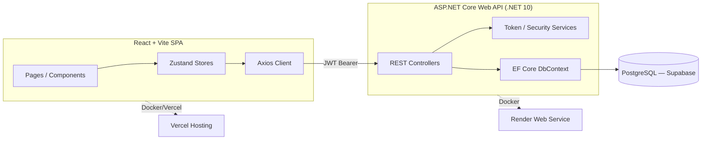

# 🎬 Bookstage — Premium Movie & Live Event Booking Platform

**A full-stack, production-grade ticket booking system built on ASP.NET Core (.NET 10) and React + Vite.**

[](https://dotnet.microsoft.com/)
[](https://react.dev/)
[](https://www.postgresql.org/)
[](https://www.docker.com/)
[](https://bookstage.vercel.app)

**[🔴 Live Demo](https://bookstage.vercel.app)** &nbsp;·&nbsp; **[📦 Source Code](https://github.com/bharatdhuva/bookstage)**

---

## 📌 Overview

Bookstage is a premium ticket booking application for movies and live events, engineered as a **decoupled backend API + SPA frontend**. It replicates the core mechanics of real-world ticketing platforms (BookMyShow, Fandango-class systems): interactive seat maps, concurrency-safe seat locking, discount validation, PDF ticket generation with QR codes, and a full admin analytics dashboard — all wrapped in a dark-themed, responsive UI.

This project was built to demonstrate production-level engineering practices: clean architecture, secure authentication, race-condition-safe booking logic, and cloud-native deployment — not just CRUD.

---

## 🧠 Highlights for Reviewers

| Area | What it demonstrates |
| :--- | :--- |
| **Concurrency handling** | `SeatLocks` table with unique constraints + expiry timestamps prevents two users from booking the same seat — a real distributed-systems problem, not just a UI toggle |
| **Security** | JWT Bearer auth, ASP.NET Core Identity password hashing, Axios interceptors for token refresh/eviction on the client |
| **Architecture** | Fully decoupled REST API (ASP.NET Core) and SPA (React/Vite) — independently deployable, independently scalable |
| **Data layer** | EF Core with PostgreSQL, migrations, health checks, and a seed pipeline for demo/test data |
| **DevOps** | Dockerized backend, deployed as a cloud Web Service on Render; frontend deployed on Vercel with environment-based config |
| **UX depth** | Discount/coupon validation, dynamic global search, PDF ticket + QR generation, admin analytics via Recharts |

---

## 📖 Table of Contents

- [Tech Stack](#️-tech-stack--dependencies)
- [Architecture](#-architecture)
- [Project Structure](#-project-structure)
- [Database Schema](#️-database-schema--data-tally)
- [API Reference](#-api-endpoint-inventory)
- [Local Setup](#-local-setup-guide)
- [Production Deployment](#-production-deployment-guide)

---

## 🛠️ Tech Stack & Dependencies

### Backend (API Service)
| Layer | Technology |
| :--- | :--- |
| Framework | ASP.NET Core (.NET 10.0 Web API) |
| Database & ORM | PostgreSQL via Entity Framework Core (`Npgsql.EntityFrameworkCore.PostgreSQL`) |
| Auth & Tokens | JWT Bearer authentication (`Microsoft.AspNetCore.Authentication.JwtBearer`) |
| Password Hashing | ASP.NET Core Identity (`Microsoft.AspNetCore.Identity`) |
| Health Checks | `Microsoft.Extensions.Diagnostics.HealthChecks` (custom PostgreSQL connectivity check) |
| API Docs | Microsoft OpenApi (`Microsoft.AspNetCore.OpenApi`) |

### Frontend (SPA Client)
| Layer | Technology |
| :--- | :--- |
| Build Tooling | Vite, ESLint |
| Core | React 18, React Router DOM v6 |
| Styling / UI | Tailwind CSS, Headless UI, Radix UI, Lucide Icons, Framer Motion |
| State Management | Zustand (persisted Auth, Theme, Booking & Search stores) |
| HTTP Client | Axios (Bearer JWT injection + 401 refresh/eviction interceptors) |
| Analytics | Recharts (Admin Dashboard) |
| Utilities | date-fns, qrcode, html2canvas, jsPDF |

---

## 🏗️ Architecture

Bookstage follows a **decoupled client-server architecture** — the API has no knowledge of the frontend and can serve any client (web, mobile, etc.).



**Key architectural decisions:**
- **Decoupled deployment** — frontend on Vercel, backend as a Dockerized service on Render, each scaling independently.
- **DTOs at the boundary** — API never leaks EF Core entities directly to clients; all I/O goes through Request/Response DTOs.
- **Concurrency-safe locking** — seat locks are a first-class entity (`SeatLocks`) with expiry + unique constraints, rather than an in-memory flag, so the system survives server restarts and horizontal scaling.

---

## 📂 Project Structure

Bookstage consists of a decoupled backend API and a React SPA frontend:

```text
├── backend/                             # .NET 10.0 Web API Solution
│   ├── Bookstage.Api/                   # Core Web API Project
│   │   ├── Controllers/                 # REST Controller Endpoints
│   │   ├── Domain/                      # Domain Entities & Models
│   │   │   └── Entities/                # Database entities (User, Movie, Event, etc.)
│   │   ├── DTOs/                        # Request/Response Data Transfer Objects
│   │   ├── Infrastructure/              # EF Core DB Context & Initial Seeder
│   │   │   ├── Data/
│   │   │   │   ├── BookstageDbContext.cs# EF Core DbContext with model configurations
│   │   │   │   └── DataSeeder.cs        # Seeds test data for movies, events, and bookings
│   │   │   └── HealthChecks/            # Custom health checks (PostgreSQL connectivity)
│   │   ├── Migrations/                  # EF Core Database Migrations
│   │   ├── Services/                    # Token Services & Security logic
│   │   ├── Program.cs                   # API Startup & Configuration
│   │   ├── Dockerfile                   # Deployment Dockerfile for backend service
│   │   ├── RENDER_DEPLOYMENT.md         # Detailed instructions for Render cloud setup
│   │   └── RENDER_ENVIRONMENT_VARIABLES_CHECKLIST.md
│   └── Bookstage.sln                    # Visual Studio Solution File
│
├── frontend/                            # React + Vite Client Application
│   ├── src/
│   │   ├── components/                  # Shared Layout and UI components
│   │   │   ├── layout/                  # Navbar, Footer
│   │   │   └── ui/                      # Loading screen, custom UI components
│   │   ├── pages/                       # Application Pages & View logic
│   │   │   ├── auth/                    # Login, Register
│   │   │   ├── BookingConfirm.jsx       # Invoice generation, PDF ticket download & QR Code
│   │   │   ├── Checkout.jsx             # Payment page with discount codes and tax calculations
│   │   │   ├── EventDetail.jsx          # Event summary, show times & selection
│   │   │   ├── Events.jsx               # Categorized live events list (Concerts, Sports, etc.)
│   │   │   ├── Home.jsx                 # Dashboard with now-playing movies & upcoming events
│   │   │   ├── MovieDetail.jsx          # Movie details, cast, reviews & showtimes list
│   │   │   ├── Movies.jsx               # Movies catalog with category filtering
│   │   │   ├── MyBookingsImpl.jsx       # Booking list and cancellation triggers
│   │   │   ├── Profile.jsx              # Profile details editor
│   │   │   └── Search.jsx               # Dynamic global search
│   │   ├── services/                    # Axios API client integrations
│   │   │   └── api.js                   # REST API requests for all modules
│   │   ├── store/                       # Zustand State Stores
│   │   │   └── index.js                 # Auth, Theme, Booking & Search states
│   │   ├── utils/
│   │   │   └── supabase.js              # Supabase Client setup for media preview/db
│   │   ├── App.jsx                      # Router & Route guards definition
│   │   ├── index.css                    # Global CSS styling & Tailwind config integration
│   │   └── main.jsx                     # Client entry point
│   ├── tailwind.config.js               # Tailwind CSS theme customization
│   └── vite.config.js                   # Vite configuration (Proxy rules)
│
├── Dockerfile                           # Root-level multi-stage Dockerfile
└── .dockerignore                        # Docker exclude configuration
```

---

## 🗄️ Database Schema & Data Tally

The schema maps 10 entity tables managed via Entity Framework Core:

| Entity Table | Purpose / Description | Primary Key | Key Fields & Configuration |
| :--- | :--- | :--- | :--- |
| **Users** | Core accounts with profiles | `Guid` | `Email` (Unique, Max 256), `PasswordHash`, `FullName` (Max 200), `Phone`, `City` (Max 100), `DateOfBirth`, `Role` (Admin/User) |
| **Movies** | Movie catalog | `Guid` | `Title` (Max 500), `Genre` (Max 200), `Language` (Max 50), `Rating`, `Duration`, `ReleaseDate`, `PosterUrl`, `YoutubeTrailerId` |
| **ShowTimes** | Movie screening schedules | `Guid` | `MovieId` (FK), `VenueName` (Max 300), `VenueCity` (Max 100), `ShowDate`, `ShowTimeOfDay`, `Price`, `TotalSeats`, `AvailableSeats` |
| **Events** | Live events (Concerts, Sports, etc.) | `Guid` | `Title` (Max 500), `Category` (Max 100), `VenueName`, `VenueCity`, `EventDate`, `EventTime`, `Price`, `Rating`, `YoutubeTrailerId` |
| **Seats** | Individual seat state per showtime | `Guid` | `ShowTimeId` (FK), `SeatNumber` (Max 50), `Row` (Max 10), `Category` (VIP/Premium/Standard), `Price`, `Status` (Available/Locked/Booked) |
| **SeatLocks** | Temporary 5-minute locks | `Guid` | `ShowTimeId`/`EventId` (FK), `SeatId`, `LockedByUserId` (FK), `LockedAt`, `ExpiresAt`, `IsConfirmed` (unique constraints prevent double locks) |
| **Bookings** | Confirmed bookings for movies/events | `Guid` | `UserId` (FK), `BookingType` (Movie/Event), `EventOrMovieTitle`, `SeatsBooked` (JSON/Comma-delimited), `TotalPrice`, `Status`, `PaymentId` |
| **Payments** | Log of payment confirmations | `Guid` | `BookingId` (FK), `UserId` (FK), `Amount`, `PaymentMethod` (Max 50), `TransactionId` (Unique, Max 200), `Status` |
| **Offers** | Discount coupon lookup | `Guid` | `Code` (Unique, Max 50), `Type` (Percentage/Flat), `DiscountValue`, `ValidFrom`, `ValidTo` |
| **Reviews** | Movie & event ratings | `Guid` | `UserId` (FK), `MovieId`/`EventId` (FK), `Rating` (1–5 stars), `Title`, `Comment`, `CreatedAt` |

### 🌱 Seed Data Stats
When running in `Development` or with `Database:SeedDataOnStartup=true`, the system seeds:
- **Users:** 3 initial profiles (`john@example.com` / User, `jane@example.com` / User, `admin@bookstage.com` / Admin)
- **Movies:** 4 featured films (*Pushpa 2, Dune 2, Mohan Lal, Kalki*)
- **ShowTimes:** 5 distinct screenings across venues
- **Seats:** 150 configurable seats per showtime with VIP/Premium/Standard pricing
- **Events:** 4 live events across Concerts, Sports, Comedy, and Theatre
- **Bookings & Payments:** 3 sample completed orders for instant stat visualization
- **Discount Offers:** 3 promotional coupon codes

---

## 🔌 API Endpoint Inventory

All endpoints are hosted under `/api` and secured with JWT where indicated.

### 🔑 Authentication & Profile — `/api/auth`, `/api/users`
| Method | Endpoint | Description |
| :--- | :--- | :--- |
| `POST` | `/api/auth/register` | Register a new account |
| `POST` | `/api/auth/login` | Login & acquire JWT token |
| `GET` | `/api/auth/me` | Retrieve active user details from token *(Authorized)* |
| `GET` | `/api/users/me` | Read detailed profile *(Authorized)* |
| `PUT` | `/api/users/me` | Update profile details *(Authorized)* |

### 🎬 Movies & ShowTimes — `/api/movies`, `/api/showtimes`
| Method | Endpoint | Description |
| :--- | :--- | :--- |
| `GET` | `/api/movies` | Query all movies (filter by `nowShowing=true|false`) |
| `GET` | `/api/movies/{id}` | Get single movie details |
| `GET` | `/api/movies/{id}/showtimes` | Get all showtimes for a movie by city |

### 🎭 Live Events — `/api/events`
| Method | Endpoint | Description |
| :--- | :--- | :--- |
| `GET` | `/api/events` | Retrieve event list (category/city filters) |
| `GET` | `/api/events/{id}` | Fetch specific event details |
| `POST` | `/api/events` | Create new live event *(Admin)* |
| `PUT` | `/api/events/{id}` | Edit event details *(Admin)* |
| `DELETE` | `/api/events/{id}` | Delete live event *(Admin)* |

### 💺 Seat Management & Locks — `/api/seats`
| Method | Endpoint | Description |
| :--- | :--- | :--- |
| `GET` | `/api/seats/{showtimeId}` | Get availability layout and active locks/bookings |
| `POST` | `/api/seats/{showtimeId}/lock` | Acquire 5-minute temporary seat lock *(Authorized)* |
| `POST` | `/api/seats/{showtimeId}/unlock` | Release held seat lock *(Authorized)* |
| `POST` | `/api/seats/{showtimeId}/confirm` | Update locked seats to confirmed *(Authorized)* |

### 🎟️ Bookings & Offers — `/api/bookings`, `/api/offers`
| Method | Endpoint | Description |
| :--- | :--- | :--- |
| `POST` | `/api/bookings` | Create booking invoice *(Authorized)* |
| `GET` | `/api/bookings/my` | Fetch bookings for the logged-in user *(Authorized)* |
| `GET` | `/api/bookings/{id}` | Retrieve details of a specific booking *(Authorized)* |
| `PUT` | `/api/bookings/{id}/cancel` | Cancel booking, issue 80% refund *(Authorized)* |
| `POST` | `/api/offers/validate` | Validate promo coupon and apply discount *(Authorized)* |

---

## 🚀 Local Setup Guide

### 1. Database Configuration
1. Host a PostgreSQL instance on [Supabase](https://supabase.com/) or run PostgreSQL locally.
2. Retrieve your connection string.

### 2. Backend Startup
```bash
cd backend/Bookstage.Api
```
Update `appsettings.Development.json` (or set environment variables):
```json
{
  "ConnectionStrings": {
    "DefaultConnection": "YOUR_POSTGRES_CONNECTION_STRING"
  },
  "Jwt": {
    "Key": "A_SECURE_256BIT_RANDOM_SECRET_KEY",
    "Issuer": "Bookstage.Api",
    "Audience": "Bookstage.Client"
  },
  "Database": {
    "ApplyMigrationsOnStartup": true,
    "SeedDataOnStartup": true
  }
}
```
Run migrations and launch:
```bash
dotnet run
```
The API starts at `http://localhost:5054`.

### 3. Frontend Startup
```bash
cd frontend
npm install
```
Create a `.env` file in `frontend/`:
```text
VITE_API_URL=http://localhost:5054/api
VITE_SUPABASE_URL=https://your-supabase-url.supabase.co
VITE_SUPABASE_PUBLISHABLE_KEY=your-supabase-pub-key
```
Start the dev server:
```bash
npm run dev
```
Open `http://localhost:5173` to test locally.

---

## 🌐 Production Deployment Guide

### Backend — Render (Docker Web Service)
1. Connect your repository to Render.
2. Select **Web Service** → **Docker** runtime.
3. Build settings:
   - **Root Directory:** *(blank)*
   - **Dockerfile Path:** `Dockerfile` (or `backend/Bookstage.Api/Dockerfile`, depending on build origin)
4. Environment variables:

| Variable | Value |
| :--- | :--- |
| `ASPNETCORE_ENVIRONMENT` | `Production` |
| `PORT` | `10000` |
| `ConnectionStrings__DefaultConnection` | `YOUR_SUPABASE_PRODUCTION_DB_STRING` |
| `Jwt__Key` | `SECURE_JWT_SIGNING_KEY` |
| `Jwt__Issuer` | `Bookstage.Api` |
| `Jwt__Audience` | `Bookstage.Client` |
| `Cors__AllowedOrigins` | `https://your-app-frontend.vercel.app` (comma-separated, no trailing slash) |
| `Database__ApplyMigrationsOnStartup` | `true` |
| `Database__SeedDataOnStartup` | `false` |

### Frontend — Vercel
1. Import the project repository into Vercel.
2. Set **Root Directory** to `frontend`.
3. Select the **Vite** preset.
4. Set environment variable:

| Variable | Value |
| :--- | :--- |
| `VITE_API_URL` | `https://your-render-backend-service.onrender.com/api` |

5. Deploy.

---

## 📬 Contributors

**Bharat Dhuva**
[Portfolio](https://bharatdhuva.vercel.app) · [GitHub](https://github.com/bharatdhuva) · bharatdhuva27@gmail.com

**Umang Vadukar**
[Portfolio](https://umangvadukar.github.io/Umang.Dev/) · [GitHub](https://github.com/UmangVadukar) · umangvadukar2005@gmail.com
